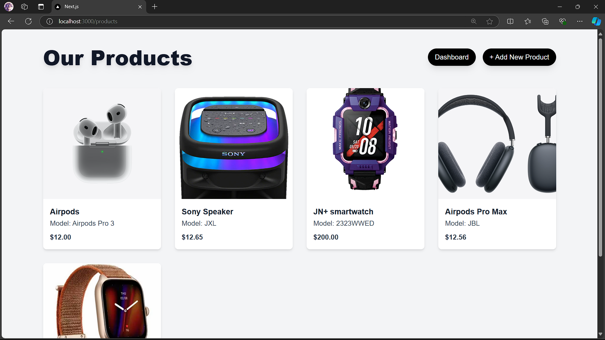
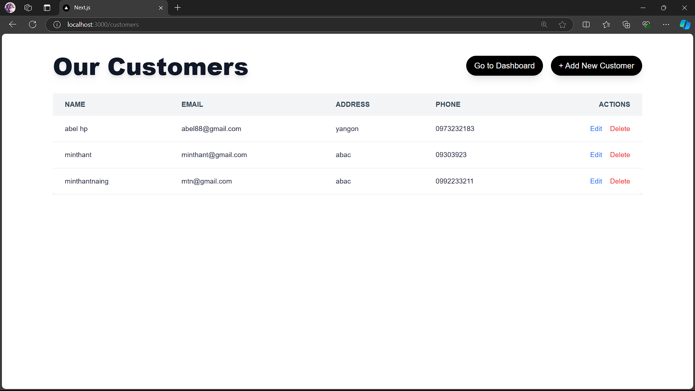
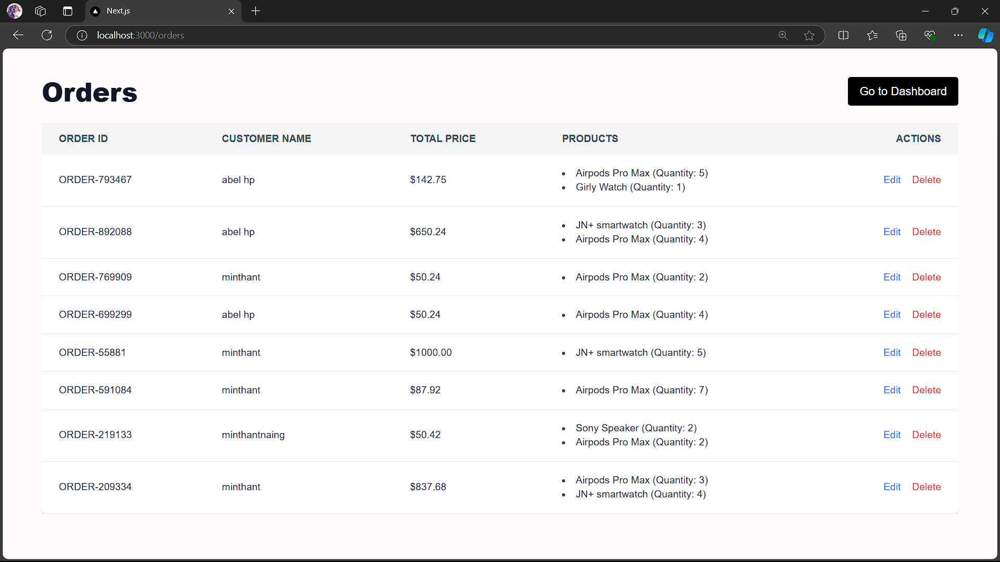
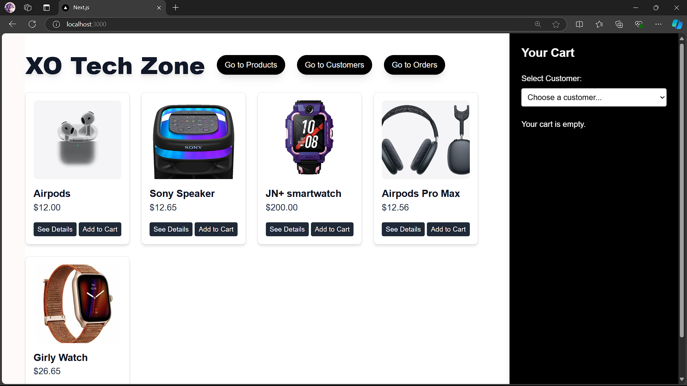

# XO Tech Zone

## Team Members
- [Thu Ya Myint Myat Thein](https://github.com/ThuYammT)
- [Min Thant Win](https://github.com/Katou69)
- [Min Thant Naing](https://github.com/minthantnaing1)

## Project Description
XO Tech Zone is an e-commerce platform for IT electronics. Customers can browse products, add them to the cart, and place orders. The project consists of several key features, including:
- Product management: Add, edit, delete, and view details of products.
- Customer management: Add, edit, and delete customers.
- Orders management: Place orders, view, edit order quantities, and delete orders.
- Cart and Checkout: Users can add items to the cart, adjust quantities, and complete purchases. Orders are assigned a random Order ID and are linked to existing customers.
- User-friendly dashboard with navigation between products, customers, and orders.

### Features:
- A responsive product display with hover effects for buttons.
- Cart functionality with real-time updates for quantity and total price.
- Order creation with customer selection from an existing list.
- Order edit and delete functionality for managing orders effectively.

## Screenshots
### Product Page


### Customer Page


### Order Page


### Dashboard


## How to Run the Project
1. Clone the repository:
   ```bash
   git clone https://github.com/ThuYammT/Final-Project.git
   cd xo-electronics-store
   
